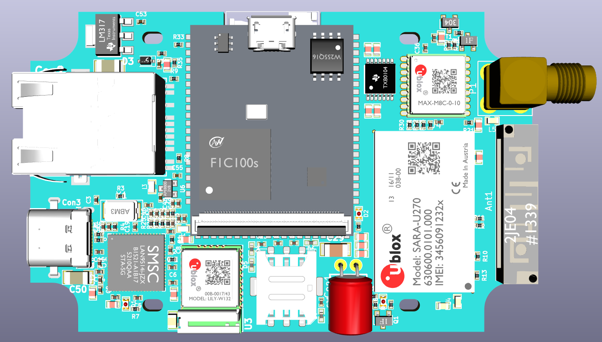
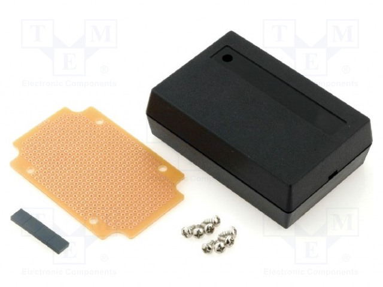

# licheepinano_sarau270_lcd
LicheePi Nano Sara U270 Development Board

3D View of Board

PCB footprint is desinged for R19-2 SCI package
https://www.tme.eu/pl/details/absp-19/obudowy-uniwersalne/sci/r19-2/

###Limitation

GSM antenna is not well designed. In this pcb footprint it can be difficult or impossible to do it well. To achieve maximum performance use SMD connector with external antenna.

